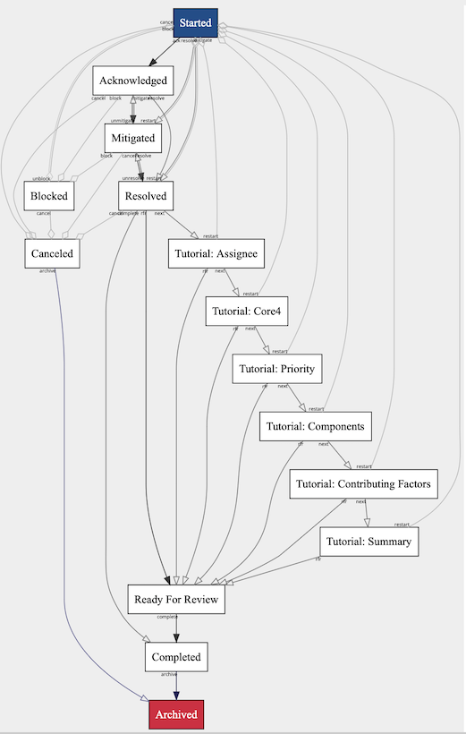
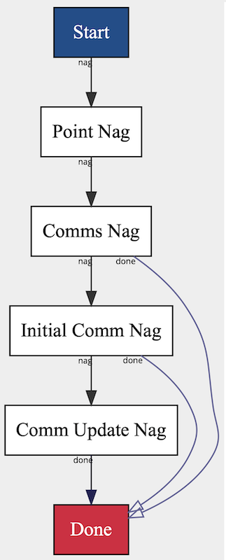

# Finite State Machines

## Introduction

In software development and system design, a Finite State Machine (FSM) is a mathematical model of computation used to design algorithms. It is an abstract machine that can be in exactly one of a finite number of states at any given time. FSMs are particularly powerful in encapsulating problems that are inherently stateful and complex. They provide a clear and structured way to model workflows, processes, and operations within various domains. 

### What is a State Machine?
A **State Machine** consists of a finite set of states, transitions between those states, and actions that can occur due to those transitions. It is "finite" because there is a limited number of states and transitions that are defined within the system. The FSM can only occupy one state at any particular time, moving from one state to another when triggered by an action or event.

### Why Use State Machines?
State Machines are best suited for managing complex scenarios with well-defined states and rules of progression because:

1. **Predictability**: Each state and transition is explicitly defined, reducing unpredictability in system behavior.
2. **Maintainability**: They make it easier to follow and understand the flow of a process, contributing to easier maintenance and enhancement of the system.
3. **Debuggability**: Issues can be traced through the defined states and transitions, simplifying the debugging of complex flows.
4. **Explicitness**: All possible states and transitions must be accounted for, decreasing the likelihood of unhandled cases.
5. **Adaptability**: State Machines are easily extended with new states and transitions as systems evolve.

## Our Usage

Our primary usage is in managing incidents:

We also use short lived machines in each of Annoytron's event loop iterations:

### Complex Behaviors
FSMs shine in encapsulating complex behaviors. For instance:

- Transitioning from a "Blocked" state back to "Started" shows the ability to reset the incident lifecycle after a blockage has been removed.
- The incident can be canceled from virtually any active state, reflecting the real-world possibility of a false alarm or a different prioritization.
- Review can be accurately required for incidents of a certain priority while skipped for low priority.
- Transitions to deeper states can enforce rules on the data as it flows. For example, prevent moving to "Resolved" state if we do not have acknowledgement or mitigation data.
